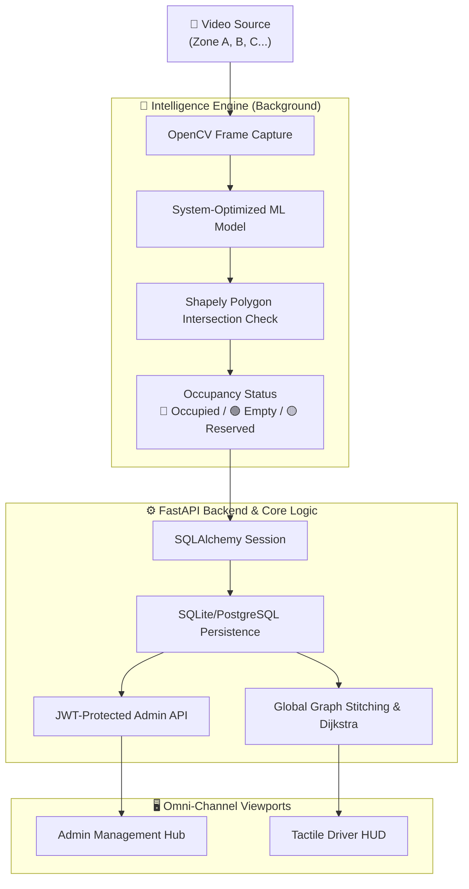

# SMART LOT: ADAPTIVE PARKING MANAGEMENT SYSTEM

> **Transforming passive surveillance into active, high-fidelity infrastructure through custom-trained intelligence.**

---

## 📋 Project Narrative
This project introduces a **Cost-Optimized, Intelligent Parking System** designed to bridge the gap between static surveillance and real-time urban management. By leveraging high-performance computer vision, we transform standard CCTV and IP camera feeds into a dynamic "Digital Twin" of the parking landscape.

Unlike traditional sensor-based systems, SmartPark utilizes a **proprietary spatial mapping engine** to determine occupancy without physical hardware installation, offering a scalable, software-first solution for smart cities.

---

## 🏗️ System Architecture (Relational 2.0)



---

## 🤖 AI Methodology: Custom Training & Optimization
The "Eyes" of the system are powered by an advanced object detection model **trained specifically for this mission profile**. 

- **Custom-Trained Model**: We moved beyond standard weights to train our model on a curated dataset of thousands of high-angle, varied-perspective parking frames.
- **System-Specific Optimization**: The model is fine-tuned to recognize 8 distinct vehicle classes under challenging lighting and perspective distortions common in parking lots.
- **Geometric Logic**: Occupancy is determined via a high-precision intersection algorithm:
  `Intersection(Detection_Poly, ROI_Poly).Area / ROI_Poly.Area > 0.15`

---

## 📁 Project Ecosystem

```
CSProj12/
├── backend/
│   ├── main.py              # FastAPI Service & JWT Gatekeeper
│   ├── models.py            # Relational Schema (Lots, Zones, Nodes, Spots)
│   ├── database.py          # Flexible DB Engine (SQLite/PostgreSQL)
│   ├── migrate_db.py        # Cloud-Sync Utility
│   └── __init__.py          # Package Init
│
├── frontend/
│   ├── index.html           # Unified Landing Hub
│   ├── login.html           # Admin Authentication
│   ├── admin.html           # Lot Management Dashboard
│   ├── architect.html       # Zone Mapper & Portal Labeling
│   ├── stitcher.html        # Matrix Canvas — Global Stitching Tool
│   ├── driver.html          # Tactical HUD - Routing & Retrieval
│   ├── viewer.html          # AI Telemetry Feed
│   └── js/                  # Core Tactical JS Wrapper
│
├── doc/                     # Permanent Technical Artifacts (Walkthrough, Plans)
├── smart_lot.db             # Local Relational State
└── README.md                # This Project Manifest
```

---

## 🛠️ Tech Stack & Dependencies

| Layer | Technology | Purpose |
|-------|-----------|---------|
| **AI / ML** | Python, OpenCV, Custom-Trained Intelligence | Real-time vehicle detection |
| **Logic** | Shapely, NumPy | Geometric intersection & Dijkstra routing |
| **Backend** | FastAPI, Uvicorn | High-throughput asynchronous routing |
| **Database** | SQLAlchemy, SQLite/Postgres | Relational persistence & cloud readiness |
| **UX** | HTML5, CSS3, JavaScript | Cyberpunk-tactical UI & tactile feedback |

---

## 🚀 Usage & Deployment

### 1. Launch the System
```bash
pip install fastapi uvicorn opencv-python ultralytics shapely python-multipart sqlalchemy pyjwt passlib[bcrypt]
python backend/main.py
```
*Access local services at `http://localhost:8000`.*

### 2. Administrator Workflow
- **Creation**: Define Parking Lots and upload zone video feeds.
- **Architecture**: Draw spot ROIs and name "Portals" (Entrances/Exits).
- **Stitching**: Visually align zones into a unified global coordinate system.

### 3. Driver Workflow
- **Discovery**: Navigate the global stitched map.
- **Retrieval**: Save parked location for single-click reverse navigation.
- **Tactile Alerts**: Receive phone vibrations and audio pings for spot status updates.

---

## 🏁 Future Works & Strategic Roadmap
We envision SmartPark as the backbone of an integrated smart-city mobility grid.

1.  **Global Location & GPS Integration**: Implementing true latitude/longitude mapping for lot discovery on external GPS services.
2.  **Omni-viewport Deployment**: Expanding the HUD to work natively on **In-Car Infotainment Screens** (Android Auto/CarPlay), dedicated **Kiosk Tablets**, and wearable devices.
3.  **Predictive Telemetry**: Analyzing historical occupancy data to provide drivers with "Availability Predictions" (e.g., *“This lot is usually full in 15 minutes”*).
4.  **License Plate Intelligence**: Integrating LPR for automated checkout, billing, and security authorized parking.

---

## ⚠️ System Limitations
- **Environmental Extrema**: Accuracy may be impacted in dense fog, torrential rain, or total nighttime darkness without IR-enabled hardware.
- **Occlusion Thresholds**: Very low camera angles may cause "Vehicle Sandwiching" where one car visually blocks another in a dense row.
- **Initial Calibration**: Requires a manual one-time mapping by an Admin to establish the digital twin of the lot.

---

## 📃 Academic Documentation
Full technical walkthroughs and deep-dive methodology reports are archived in the `doc/` directory:
- [Technical Walkthrough](file:///c:/Users/yamin/CSProj12/doc/walkthrough.md)
- [Design Methodology](file:///c:/Users/yamin/CSProj12/doc/implementation_plan.md)
- [Development Checklist](file:///c:/Users/yamin/CSProj12/doc/task.md)

---

*Prepared for Paper Presentation 2026 — SmartPark: Making ogni camera a smart parking sensor.*
